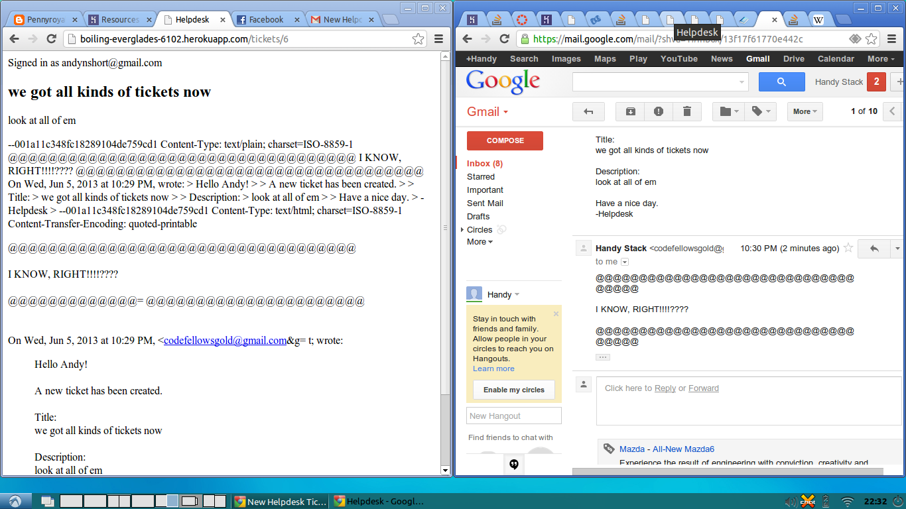

# helpdesk

This assignment explores sending and receiving mail through a rails app.

## Original Specifications:

Add email sending and receiving capability to a new app.

* Create a new app called Helpdesk
* Users can create a new ticket on a web page
* The helpdesk@example.com gets an email of the ticket's content
* helpdesk@example.com can reply via email, and the the reply gets displayed with the ticket in the web app.

## Refined Specifications:

* App name is "Helpdesk"
* Users are permitted to create at least one ticket on a web page
    * Implement Users
    * Implement permissions for Users
        * Users are permitted to create tickets
    * Implement Tickets
        * Tickets follow Ticketee model - title:string description:text
    * Implement web page interface for Ticket creation
* An administrator receives an email containing relevant ticket details upon creation of a Ticket
    * Helpdesk can send emails
* An administrator can reply via email to Ticket creation emails, and Helpdesk will display the email's contents on a web page
    * Helpdesk can receive emails

## Screenshot

